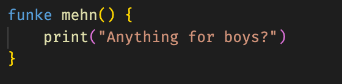
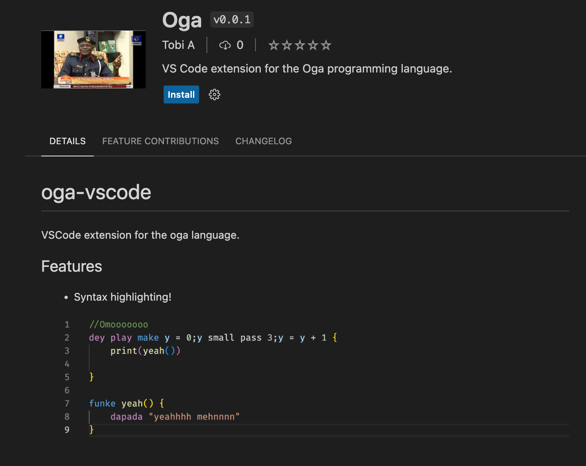
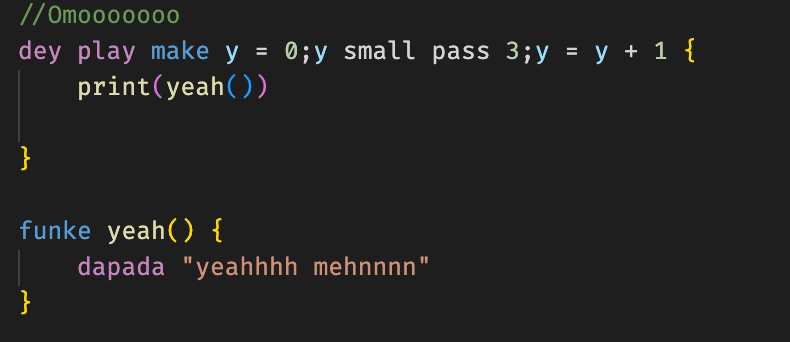

# Oga


**Oga** is an esoteric language inspired by [this](https://youtu.be/h1xva9WC4G0?t=188). This is my way of learning what it takes to implement a language. Enjoy!

## How far world
Every oga script needs a `mehn` function:



## Installing Oga
Oga is still in development, but you can download the latest experimental release on the [releases page](https://github.com/tobiade/oga/releases).

Alternatively, if you have Go installed, you can install the latest version of oga:
```sh
go install github.com/tobiade/oga@latest
```

## Installing the Oga Visual Studio Code Extension
You can search the VS Code extensions marketplace for "Oga" to install the latest version of the [Oga VS Code extension](https://github.com/tobiade/oga-vscode) which currently only provides syntax highlighting:


## Using Oga
Create your script e.g `my_script.og`:


To run your oga script:
```sh
oga abeg run my_script.og
```
However, there is no guarantee that oga will actually run your code. If you want to ensure your code is run, you have to beg by using the `pls` flag:
```sh
oga abeg run my_script.og --pls
```

## Testing?
Testimony.

## Credits
* [Yorlang](https://github.com/anoniscoding/yorlang)
* [ANTLR grammars](https://github.com/antlr/grammars-v4)
* [Ruslan](https://ruslanspivak.com/lsbasi-part1/)
* [Language Implementation Patterns](https://pragprog.com/titles/tpdsl/language-implementation-patterns/)
* [Crafting Interpreters](https://craftinginterpreters.com/)